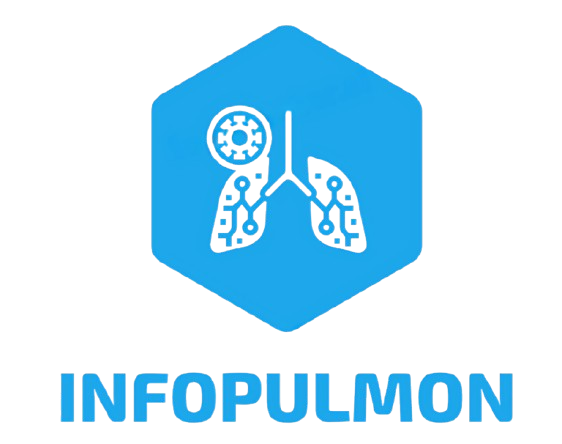

# InfoPulmón

    
    
Sitio informativo sobre el órgano pulmonar y enfermedades relacionadas a este.

## Integrantes

- Elkin Samir Angulo Panameño
- Miguel Ángel Salcedo Urián
- Anderson Felipe Pantoja Cadena
- Andres Mauricio Ramirez Rengifo

## Cómo correr el proyecto

### Requisitos

- Node.js LTS o Bun 
- NPM
- Git

### Pasos

1. Clonar el repositorio
2. Instalar las dependencias con `npm install` o `bun install`
3. Correr el proyecto con `npm run dev` o `bun dev`

## Estrucutra del proyecto

- `public/`: Archivos estáticos
- `src/`: Carpeta principal del proyecto
    - `assets/`: Imágenes y otros recursos
    - `landing/`: Módulo de página principal de la aplicación
    - `lung-diseases/`: Módulo de enfermedades pulmonares
    - `quiz/`: Módulo de cuestionario
    - `router/`: Configuración de rutas
    - `shared/`: Componentes compartidos